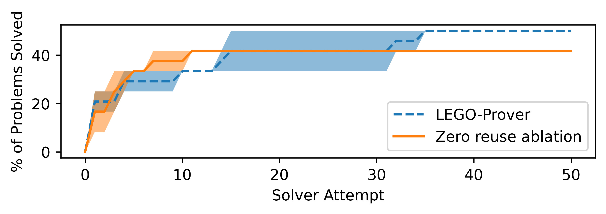

# Library Learning Doesn't: The Curious Case of the Single Use Library
## LEGO-Prover Ablation


[](https://github.com/wiio12/LEGO-Prover)
[](hhttps://github.com/wiio12/LEGO-Prover/blob/main/LICENSE)
[](https://github.com/psf/black)

This directory contains the code for reproducing the LEGO-Prover ablation performed in the paper Library Learning Doesn't: The Curious Case of the Single Use Library.


# Installation

This code is only tested under Python 3.10.12, on Ubuntu 18.04.

## Python Install
You should begin by cloning the project to local directory
```shell
git clone https://github.com/ikb-a/curious-case.git
cd LibLearningDoesnt/LEGO-Prover
python3 -m venv env
source env/bin/activate
pip install -e .
pip install -r requirements2.txt
```
**Note:** pip might give error about incompatible versions for `protobuf` and `grpcio-tools`, but it works fine (at lease for me).

**Note** There will be pip warnings about lego-prover's requirements being incompatible with the installed packages; ignore these errors.


## PISA Install
[PISA](https://github.com/albertqjiang/Portal-to-ISAbelle) (Portal to ISAbelle) is a REPL wrapper for Isabelle theorem prover. LEGO-Prover utilize PISA to communicate with Isabelle theorem prover and verify the formal code. You should follow the instruction bellow to install PISA and Isabelle.

1. **Scala configuration**
   
    Install SDKMAN
    ```shell
    cd ~
    curl -s "https://get.sdkman.io" | bash
    source .bashrc
    ```
    
    Install JAVA 11 and sbt
    ```shell
    sdk install java 11.0.11-open
    sdk install sbt
    ```

2. **Configure Isabelle**
    ```shell
    wget https://isabelle.in.tum.de/website-Isabelle2022/dist/Isabelle2022_linux.tar.gz
    tar -xzf Isabelle2022_linux.tar.gz
    export PATH="$PATH:$HOME/Isabelle2022/bin/"
    ```
    Try
    ```shell
    isabelle 
    ```
    to makes sure isabelle is properly installed.

3. **Compile PISA and Link**

    ```shell
    cd lego_prover/env/Portal-to-ISAbelle
    sbt assembly
    ```
    
    Create link so that the .jar can be found by LEGO-Prover

    ```shell
    cd ../../..
    ln -s $(realpath lego_prover/env/Portal-to-ISAbelle/target/scala-2.13/PISA-assembly-0.1.jar) lego_prover/env/Portal-to-ISAbelle/
    ```

    Note that PISA can be very finicky.

## OpenAI API Keys
This project require OpenAI API Keys to properly query the OpenAI LLMs. LEGO-Prover requires two models: gpt-4o-mini and text-embedding-ada-002. Please make sure the API key provided have access to these models.

Please place your Azure OpenAI API key in the `azure_keys.py` file.

# Evaluation

## Analysis of logs

The results of the analysis of the logs can be found in the `data_analysis` folder. 

To generate the analysis for yourself, run:

```shell
python3 data_analysis/lemma_analysis.py > data_analysis/analysis_summary.txt
```

The created .txt file contains various statistics for each of the 4 splits (to access the LEGO-Prover's original released logs, see the `result` folder).

This command also creates one subfolder in `data_analysis` per split, each of which further divides into subfolders for verbatim reuse of an input lemma (`exact_match`) and name reuse of an input lemma (`name_match`). These subfolders contain examples of lemma usage. Each folder is prefixed with the number of uses of the lemma, and only the most frequently used lemmas are reported. e.g., [data_analysis/human_informal_test/exact_match/2_exact_mathd_numbertheory_582_lemma1.md](data_analysis/human_informal_test/exact_match/2_exact_mathd_numbertheory_582_lemma1.md) is the file for a lemma that was used verbatim twice in an output solution (i.e., reused once).

## Ablation Experiments

You can run the baseline LEGO-Prover with following command; the log will be stored in the `log` directory, the checkpoints will be stored in the `checkpoints/5_valid_rand_att50` directory, and the performance will be printed to stdout.

```shell
python run_multiprocess.py --isabelle_path `realpath ~/Isabelle2022/` --data_split 'eval/valid_rand' --ckpt_dir 'checkpoints/5_valid_rand_att50/' --num_attempts '50' --num_prover 3 --num_evolver 8 > log.out
```

You can run the ablation with the following command:

```shell
python run_multiprocess.py --isabelle_path `realpath ~/Isabelle2022/` --data_split 'eval/valid_rand' --ckpt_dir 'checkpoints/7_isolated_valid_rand_att50/' --num_attempts '50' --num_prover 3 --num_evolver 8 --isolate > isolated_log.out
```

In general, the parameters are as follows:
- `resume`: whether to resume from the checkpoint.
- `data_split`: data split to use in the miniF2F dataset, choose from `valid`, `test`, and `eval/valid` (the subset of `valid` used in our experiments).
- `ckpt_dir`: path to the checkpoint directory
- `isabelle_path`: path to the Isabelle2022 installation. If you install the Isabelle in the default position, the path is usually `/home/your_name/Isabelle2022/`
- `temperature`: temperature for sampling the LLM
- `num_prover`: number of prover process running in parallel.
- `num_evolver`: number of evolver process running in parallel.
- `num_attempts`: number of proving attempts for each problem in the dataset
- `isolate`: whether to run the ablation. If provided, the sharing of lemmas across questions will be disabled.

**Note**: the Isabelle formal verifier requires enormous cpu memories and computations, so keeps the number of parallel process low if you don't have a beefy machine.

Our experiments were run on 50CPU cores and 180GB of RAM.


# Results



On 2 trials of the baseline, and 2 trials of the ablation, we found that the ablation performs similarly with the baseline only solving 1 more problem.

To create this plot, run:

```shell
python3 data_analysis/plotting.py
```

# Original LEGO-Prover License

This code is modified from the [original LEGO-Prover repository](https://github.com/wiio12/LEGO-Prover.git). The original codebase was released under an MIT license, as is this codebase. The original license can be found [here](https://github.com/wiio12/LEGO-Prover/blob/357672c7751cd0c84aff6bf72a3d1bf97614e81d/LICENSE) is also reproduced at the end of this file. 

```
MIT License

Copyright (c) 2023 MineDojo Team

Permission is hereby granted, free of charge, to any person obtaining a copy
of this software and associated documentation files (the "Software"), to deal
in the Software without restriction, including without limitation the rights
to use, copy, modify, merge, publish, distribute, sublicense, and/or sell
copies of the Software, and to permit persons to whom the Software is
furnished to do so, subject to the following conditions:

The above copyright notice and this permission notice shall be included in all
copies or substantial portions of the Software.

THE SOFTWARE IS PROVIDED "AS IS", WITHOUT WARRANTY OF ANY KIND, EXPRESS OR
IMPLIED, INCLUDING BUT NOT LIMITED TO THE WARRANTIES OF MERCHANTABILITY,
FITNESS FOR A PARTICULAR PURPOSE AND NONINFRINGEMENT. IN NO EVENT SHALL THE
AUTHORS OR COPYRIGHT HOLDERS BE LIABLE FOR ANY CLAIM, DAMAGES OR OTHER
LIABILITY, WHETHER IN AN ACTION OF CONTRACT, TORT OR OTHERWISE, ARISING FROM,
OUT OF OR IN CONNECTION WITH THE SOFTWARE OR THE USE OR OTHER DEALINGS IN THE
SOFTWARE.
```

Note that the [data/full_data](data/full_data/) directory contains problems from [a variant of the miniF2F dataset](https://github.com/albertqjiang/miniF2F) branched from the [original miniF2F dataset](https://github.com/openai/miniF2F/tree/main). Both are licensed under the [Apache V2.0 license](https://github.com/openai/miniF2F/blob/4e433ff5cadff23f9911a2bb5bbab2d351ce5554/isabelle/LICENSE); thus this directory is licensed under the same license.
