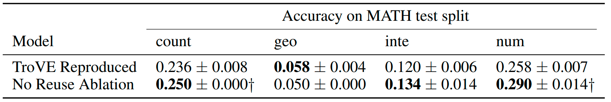

# Library Learning Doesn't: The Curious Case of the Single Use Library
## TroVE Ablation


[](https://github.com/wiio12/LEGO-Prover)
[](https://github.com/psf/black)

This directory contains the code for reproducing the TroVE ablation performed in the paper Library Learning Doesn't: The Curious Case of the Single Use Library.


# Requirements

As TroVE executes arbitrary LLM-generated code we **strongly** suggest using a sandbox to limit TroVE's network and read/write access. In our case we use singularity, which also contains the requirements. 

To install Singularity, see [https://github.com/sylabs/singularity](https://github.com/sylabs/singularity). Note that we used Singularity Community Edition 3.8.2 in our experiments.

We have provided a Ubuntu 22.04 singularity container that already contains the Python 3.10.12 environment with all its dependencies. The .sif file can be downloaded from a link [COMING SOON!].

In the case that you want to use a different method to sandbox, you can set up the Python environment by running:

```shell
pip install -r sing_requirements.txt
```

Note that sing_requirements.txt contains the exact package versions used in our singularity environment. For a list of just the high-level dependencies (which risks not working as functionality is deprecated), see requirements.txt

# Experiments

## Log analysis

The results of the log analysis can be found in a series of .md files, one per function in the library. For example, the files for the count split of MATH can be found in [ablation_experiment_results/baseline_run0/CodeLlama-7b-Instruct-hf/math/counting/results](ablation_experiment_results/baseline_run0/CodeLlama-7b-Instruct-hf/math/counting/results), the other splits can be found in the corresponding subfolders of [math](ablation_experiment_results/baseline_run0/CodeLlama-7b-Instruct-hf/math). 

To generate the markdown file for each function from the raw TroVE outputs at [ablation_experiment_results/baseline_run0](ablation_experiment_results/baseline_run0), run:

```shell
./data_exploration/function_displayer.sh
```

NOTE: To reduce the storage requirements, we searched for overly long program outputs and either truncated them or replaced them with None using the provided, script [shrink.py](ablation_experiment_results/shrink.py).

## Running TroVE Ablation in singularity:

1. Locally download/cache the required CodeLlama model files by running:
    ```shell
    python one_time_setup/download_hf_files.py
    ```

2. Download the singularity file `trove_sing_v4.sif` from this link [COMING SOON!], and place it in this directory.

2. Go into [exec_baseline_trove.sh](exec_baseline_trove.sh) and [exec_ablated_trove.sh](exec_ablated_trove.sh). Edit the environment variables in the header:
    - EXPERIMENT_NAME: The name for this experiment. A subfolder with this name will be created to store the experiment results.
    - RUN_IDX: Each run must have a unique `--run_index`; otherwise, if there is an existing run with said index, the program will assume that the previous run was interrupted and will attempt to resume said run.
    - SOURCE_FOLDER: The absolute path to the parent directory of this file, ending in a forwards slash. i.e., the result of running:
    
        ```shell
        echo `realpath ..`'/'
        ```
    - OUTPUT_FOLDER: Path to the directory in which results will be saved, ending in a slash (i.e., run the command below). TroVE will have read-write access to this directory, so the contents could be altered, deleted, or otherwise compromised by the LLM-gnerated code. Make sure there is nothing important here! This should not be a subfolder of SOURCE_FOLDER, or vice-versa.
        ```shell
        echo `realpath ~/path/to/output/directory`'/'
        ````
    - DSNAME: Which MATH split to run the model on. The options are: _math/algebra_, _math/counting_, _math/geometry_, _math/intermediate_, _math/number_, _math/prealgebra_, or _math/precalculus_

3. To run the baseline, run:

    ```shell
    ./exec_baseline_trove.sh
    ```

    To run the ablation, run:

    ```shell
    ./exec_ablated_trove.sh
    ```


## Running TroVE Ablation outside of Singularity (UNSAFE)

These instructions are **unsafe** as they execute arbitrary LLM-generated Python code on your machine. They are provided **solely** to explain how to run TroVE, so that you can setup a different sandbox should you wish. 

To prevent accidents, we have added the `--disable_llm` flag so that the commands below do not execute LLM generated Python code. Inside of a sandbox, you would run the commands below with this flag removed.

To run baseline TroVE on the intermediate split of MATH, you would run:

```shell
# (UNSAFE) executes LLM-generated Python code without sandboxing if --disable_llm removed
python run_trove.py --task_name math/intermediate --exec_file "tmp_exec_`date -Ins`.py"  --verbose --preemptable --preemption_log_freq 12 --run_index 0 --disable_llm
```

To run the ablated model, you would add the `--ablation1` flag:

```shell
# (UNSAFE) executes LLM-generated Python code without sandboxing if --disable_llm removed
python run_trove.py --task_name math/intermediate --exec_file "tmp_exec_`date -Ins`.py"  --verbose --preemptable --preemption_log_freq 12 --run_index 0 --ablation1 --disable_llm
```

These commands would save logs and checkpoints to the default location, `./outputs`; this behaviour can be overriden by setting the `OUTPUT_FOLDER` environment variable; e.g., `export OUTPUT_FOLDER="/my/output/folder/"`

In general, specify the task name as _math/${dataset_name}_, e.g., _math/algebra_. See [data/math/](data/math/) for the available MATH splits. Note that the specified `--task_name` argument should be lowercased.

Each run must have a unique `--run_index`; otherwise, if there is an existing run with said index, the program will assume that the previous run was interrupted and will attempt to resume said run.

# Results



To produce the values in the table above, run:

```shell
python data_exploration/calc.py
```

# Licensing 

This repository is a modification of the [original TroVE codebase](https://github.com/zorazrw/trove), which was made available under a [CC-BY-SA-4.0 license](https://github.com/zorazrw/trove/blob/c4d16b6a2e38020540db2a611fdea722da6b880c/LICENSE.md). As per the license, this modified work is shared under the same license.

Note that the [data/math](data/math) directory contains data from the [MATH dataset](https://github.com/hendrycks/math), which is licensed under an [MIT license](https://github.com/hendrycks/math/blob/357963a7f5501a6c1708cf3f3fb0cdf525642761/LICENSE). We do not change this directory from the TroVE repository.
